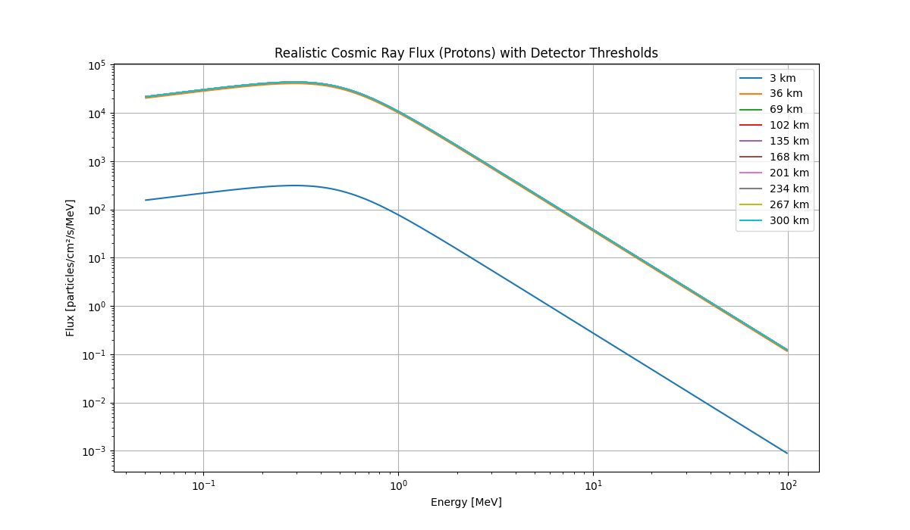
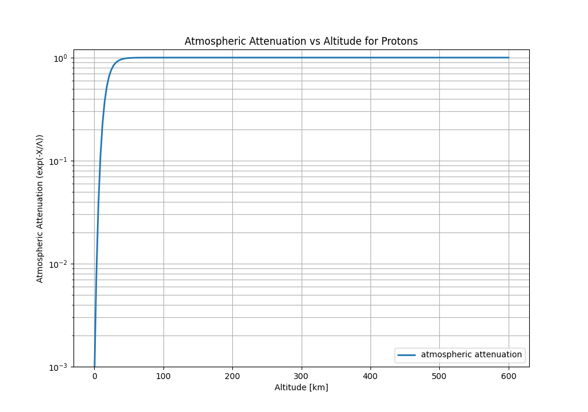
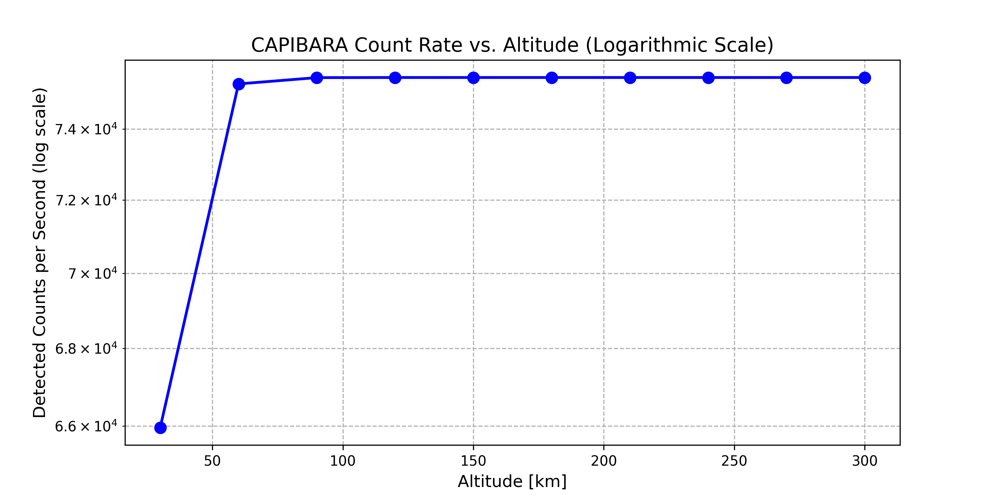
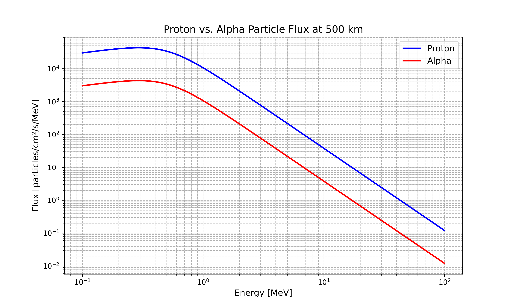
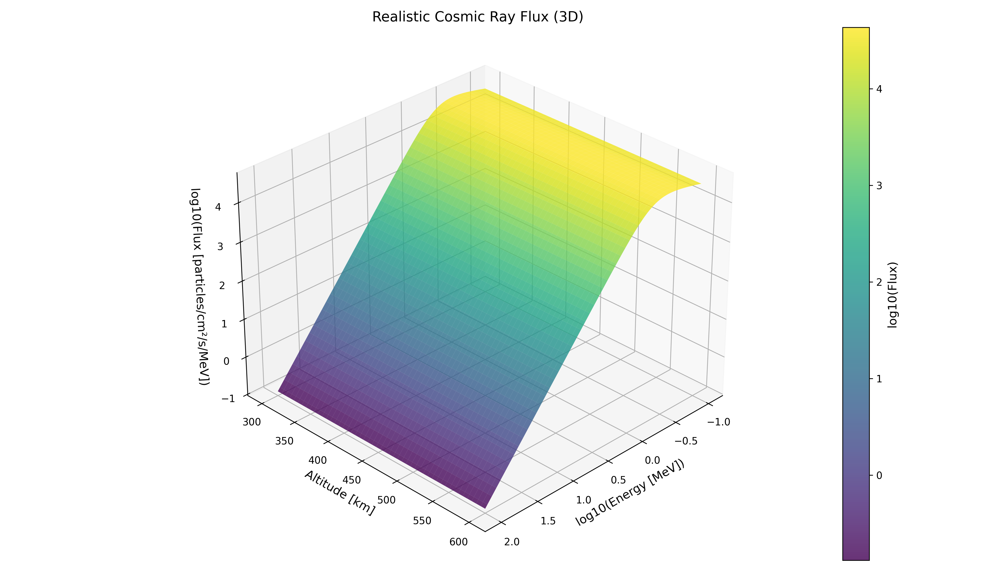

# Simplified Explanation of the Realistic Cosmic Ray Model

## 1. What Does This Model Do?

Goal: Simulate how many cosmic ray particles hit our detector in space, based on:

* Particle energy (low vs. high energy).
* Altitude (300–600 km above Earth).
* Detector limits (only detects particles between 50 keV and 100 MeV).

**Why?** To predict how often our detector will "see" particles and avoid false signals.

## 2. How Cosmic Ray Flux Works
**(A) Particle Flux in Space**

Cosmic rays are mostly protons (90%) and alpha particles (9%) from:
* Galactic Cosmic Rays (GCRs): Come from outside our solar system.
* Solar Energetic Particles (SEPs): Bursts from the Sun.

Flux depends on:
* Energy: Higher-energy particles are rarer, following a power-law $F \propto E^{-2.7}$, where $F$ is the flux and $E$ the energy of a particle.
* Altitude:
  * At high altitudes (e.g., 600 km): More particles (less atmosphere blocking them).
  * At low altitudes (e.g., 300 km): Fewer particles (atmosphere absorbs them).
* Earth’s magnetic field: Blocks low-energy particles (ignored for now but noted).

**(B) Detector Physics**

Our detector uses:

* Plastic scintillator (EJ-200):
  * Glows when particles hit it (~10,000 light photons per MeV of energy).
  * Size: 1.5 cm × 1.5 cm (small, so it won’t catch all particles).
* SiPM sensor:
  * Only detects particles with energy between 50 keV and 100 MeV.
  * Ignores particles outside this range (too weak or too strong).

Key Simplifications:
 * Assumes particles lose energy linearly in the scintillator (real physics is more complex).
 * Approximates atmospheric blocking with exponential decay.

## 3. Files
* `01a_flux_vs_altitude.py`: Calculates particle flux at different altitudes.
* `01b_atmospheric_attenuation.py`: Creates attenuation vs altitude figure.
* `02_log_counts_vs_altitude.py`: Simulates particle count in the detector in function of altitude.
* `03_proton_vs_alpha.py`: Compares flux and energy detection between protons and alpha particles.
* `04_flux_energy_altitude.py`: Combines flux per energy and altitude to show a 3D surface plot.
* `main.py`: Contains `Detector` class and `cosmoc_ray_flux` function for all other files.

**Requirements:** `numpy matplotlib`

## 4. Results

### Flux vs Altitude

Shows how particle flux increases with altitude. At high altitudes attenuation is negligible (see next figure).

### 01b Atmospheric Attenuation vs Altitude

Figure shows how atmosphere blocks more particles at lower altitudes and that at $\sim 100\ \mathrm{km}$, the atmospheric attenuation is negligible. Typical LEO altitudes are $300-600\  \mathrm{km}$.

### 02 Log Counts vs Altitude

Shows particle flux in counts and in dependence of altitude. The detector only sees a small fraction of the total flux due to its small size and energy limits.

### 03 Proton vs Alpha

Shows comparison between proton and alpha particle flux and energy detection, where protons are 10x more frequent than alpha particles.

### 04 Flux Energy Altitude

3D surface plot showing how flux varies with both energy and altitude. Higher altitudes and lower energies yield higher fluxes, but the detector only captures a small portion due to its energy limits.